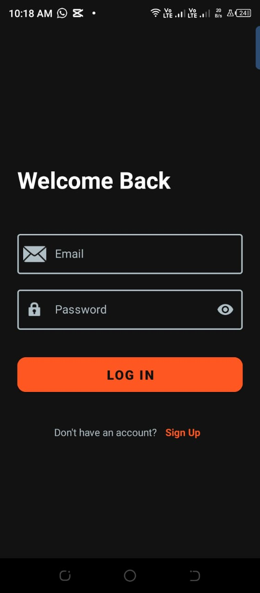
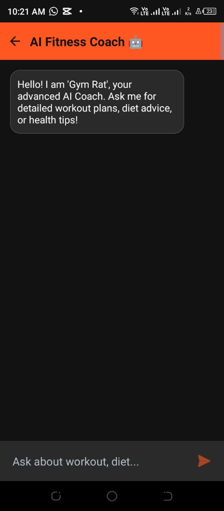
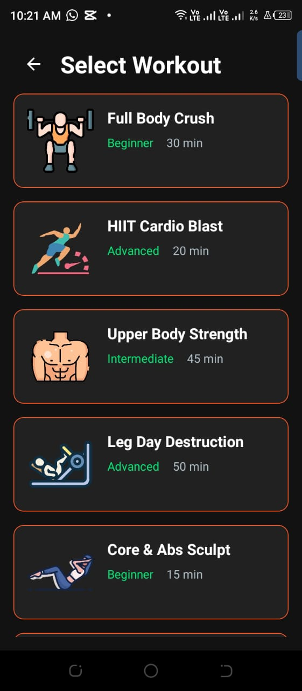
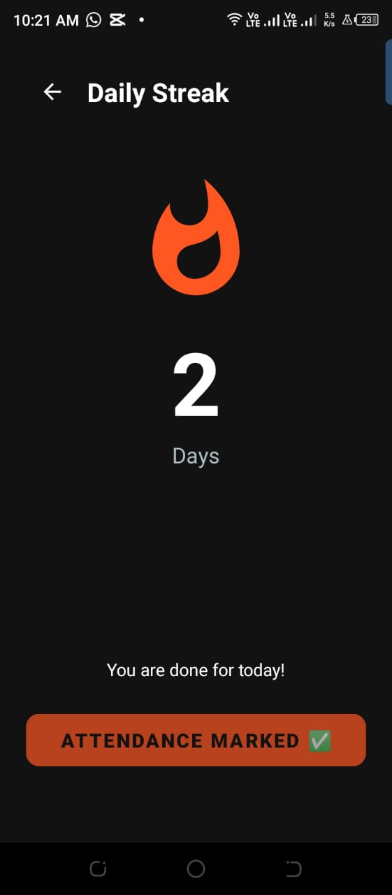
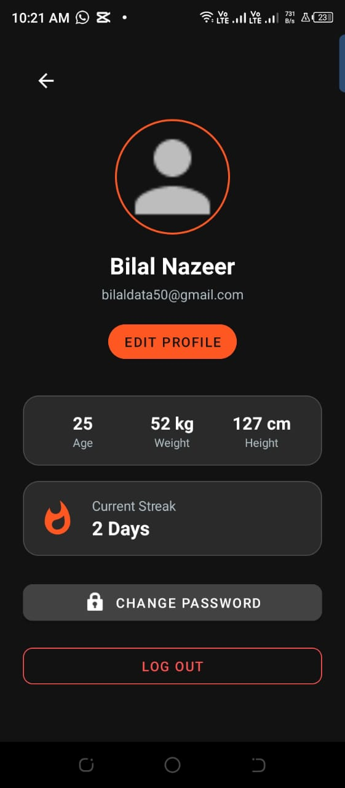

# 🐀 Gym Rat - AI Powered Fitness Companion

   

**Gym Rat** is a comprehensive, native Android application designed to bridge the gap between static fitness tracking and personalized coaching. Built with **Kotlin** and the **MVVM architecture**, it leverages **Google's Gemini Generative AI** to act as a 24/7 personal trainer while gamifying consistency through a robust streak system.

---

## 📱 App Screenshots

| **Login & Auth** | **Home Dashboard** | **AI Coach** |
|:---:|:---:|:---:|
|  |  |  |
| *Secure Firebase Authentication* | *Central hub with Streak & Navigation* | *Real-time fitness advice via Gemini AI* |

| **Workout Plans** | **Daily Attendance** | **Profile & Settings** |
|:---:|:---:|:---:|
|  |  |  |
| *Curated plans with timers* | *Gamified consistency tracking* | *Local storage for images & security* |

> **Note:** Screenshots are located in the `screenshots/` directory.

---

## 🚀 Key Features

### 🤖 AI Personal Trainer
Integrated with **Google Gemini 1.5 Flash API**, the AI Coach understands natural language queries. It is system-prompted to act as a professional fitness expert, providing structured, bulleted advice on:
* Workout form and techniques.
* Nutritional guidance and meal planning.
* Injury prevention and recovery.

### 🔥 Gamified Streak System
A "Daily Attendance" module designed to boost user retention.
* **Logic:** Validates the current server date against the user's history. Streaks only increment on consecutive days and reset if a day is missed.
* **Visuals:** Includes bounce animations and status updates (e.g., "Attendance Marked ✅") to provide immediate feedback.

### 🏋️ Structured Fitness Tools
* **Workout Library:** Pre-defined plans (HIIT, Strength, Yoga, Cardio) with detailed step-by-step instructions.
* **Active Timer:** Integrated chronometer for tracking workout duration.
* **Diet Plans:** Nutritional roadmaps for specific goals like Muscle Gain, Keto, and Weight Loss.
* **BMI Calculator:** Real-time calculation with visual health category indicators (Underweight, Normal, Obese).

### 👤 Advanced Profile Management
* **Real-time Sync:** Fetches user statistics (Age, Weight, Height) from Firestore instantly using `SnapshotListeners`.
* **Privacy-Focused Image Storage:** Profile pictures are saved directly to the device's **Internal Storage**. This ensures images load instantly and respects user privacy by keeping personal photos local.
* **Security:** "Change Password" functionality requires re-authentication with the old password before updates are allowed.

---

## 🛠️ Technical Architecture

The project follows the **Model-View-ViewModel (MVVM)** architectural pattern to ensure separation of concerns and testability.

* **Language:** Kotlin
* **UI Toolkit:** XML Layouts using **ViewBinding** for type-safe view interaction.
* **Navigation:** Android Navigation Component (Single Activity Architecture).
* **Backend:**
    * **Firebase Authentication:** Handles secure user login and registration.
    * **Cloud Firestore:** NoSQL database for storing user profiles, attendance logs, and streak counters.
* **AI Integration:** Google Generative AI Client SDK (Gemini).
* **Image Loading:** Glide (Optimized with `DiskCacheStrategy` for immediate UI updates).
* **Asynchronous Processing:** Kotlin Coroutines for non-blocking API calls and database operations.

---

## ⚙️ Setup & Installation

1.  **Clone the Repository:**
    ```bash
    git clone [https://github.com/YourUsername/GymRat.git](https://github.com/YourUsername/GymRat.git)
    ```
2.  **Open in Android Studio:**
    Open the project folder in the latest version of Android Studio.

3.  **Firebase Configuration:**
    * Create a project on [Firebase Console](https://console.firebase.google.com/).
    * Add an Android App with package name: `com.example.gymrat`.
    * Download `google-services.json` and paste it into the `app/` directory.

4.  **API Key:**
    * Get an API Key from [Google AI Studio](https://aistudio.google.com/).
    * Open `ChatFragment.kt` and replace `val apiKey` with your key.

5.  **Build & Run:**
    Sync Gradle and run on an Emulator or Physical Device.

---

## 📄 License
This project is created for academic/portfolio purposes.
**Developed by Bilal Nazeer**
